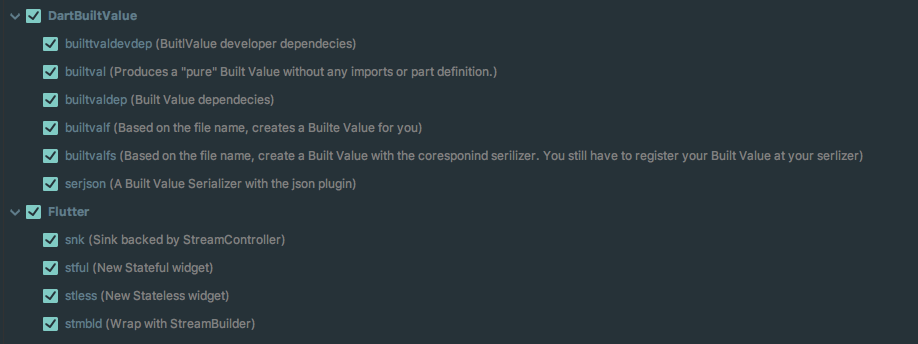
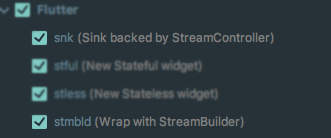

# flutter_dart_live_template
A collection of my personal [Flutter](https://flutter.io) / [Dart](https://www.dartlang.org) [Live Templates](https://www.jetbrains.com/help/idea/using-live-templates.html) which I use. 

## To import live template configuration into your Intellij / WebStorm / Android Studio: 
1. [Download the jar](https://github.com/swissonid/flutter_dart_live_template/raw/master/flutter_built_value_template.jar).
2. Open Intellij / WebStorm / Android Studio
3. On the **File** menu, click **Import Settings**.
4. Specify the path to the JAR file with the exported live template configuration
5. In the **Import Settings** dialog box, select the **Live templates** check box and click **OK**.
6. After restarting IntelliJ IDEA, you will see the imported live templates on the [Live Templates][1] page of the [Settings / Preferences Dialog](https://www.jetbrains.com/help/idea/settings-preferences-dialog.html).
7. If everything worked well you should see something like that in your [Live Templates][1]

## Live Templates in Action 🎬

___

[1]: https://www.jetbrains.com/help/idea/settings-live-templates.html

# Todos ✅ / Ideas 💡
- [ ] Get the newest version for the **builtvaldevdep** sniped live from [pub.dartlang.org](https://pub.dartlang.org/)

- [ ] Make renaming of **Built Value** easier

# Disclaimer Flutter 
The two snipped (**snk** & **stmbld**) in the flutter section, are just my implementation of the snippes from [Filip Hracek](https://github.com/filiph) which you can see at the flutter talk [**Build   reactive mobile apps with Flutter** at Google I/O](https://youtu.be/RS36gBEp8OI?t=24m16s) or in [The Boring Flutter Development Show, Ep. 4](https://youtu.be/fahC3ky_zW0?t=56m55s)

